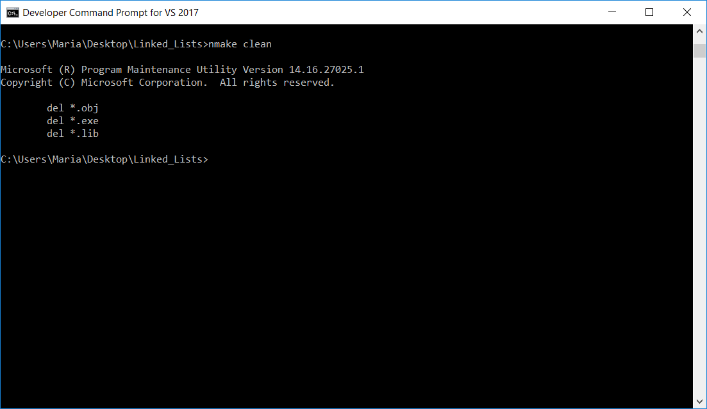

# Linked Lists in C++

## Programming Fundamentals (SET07109) 2017

### Coursework 2 - Edinburgh Napier University

Compiled using Visual Studio Command Line (C++ must be installed in VS)

This program uses C++ to test a variety of methods on linked list data structures.

To run the program, write ```nmake``` on  the console.
To clean the program, write ```nmake clean```.

Toolchain:
  Visual studio 2017:
    cl version 19.10.25017
    nmake version 14.10.25017.0

Makefile targets:

    all -> Build the library, compile test.cpp and execute

    library -> Just build the library

    clean -> Remove all object, executables and library files

**Screenshots**


nmake clean:


